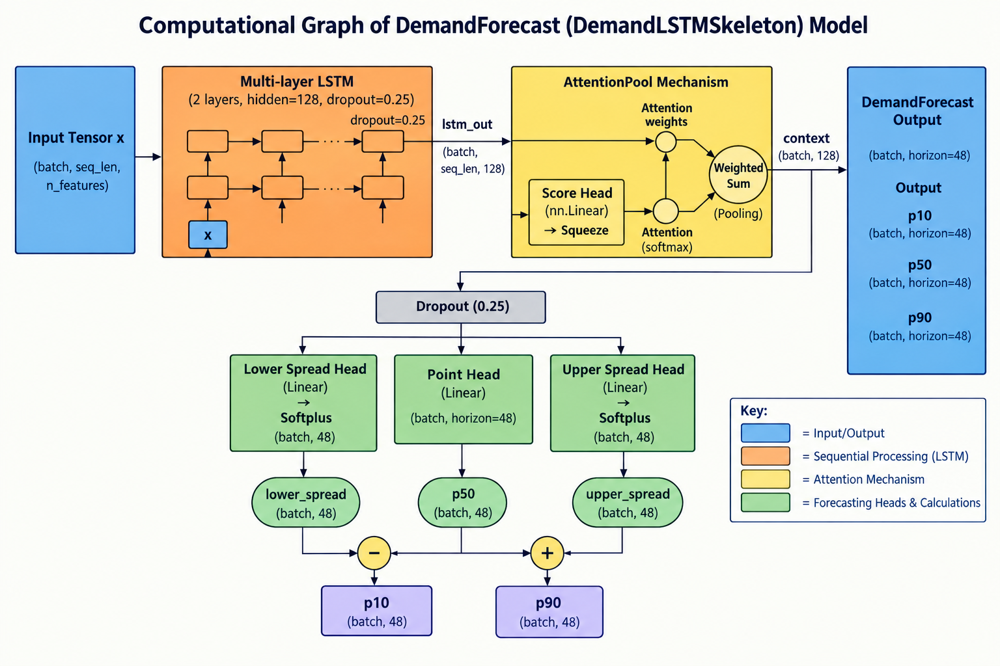

# End-to-End Model Architecture

How a real electricity-market reading becomes a served demand forecast:
data source → ingestion → warehouse → feature engineering → training →
MLflow registry → serving → dashboard. Verified against the live code in
`services/ingestion/`, `services/waerehouse/`, and `services/forecast-api/`
on 2026-09-09.

Companion docs: `docs/data/ingestion.md` (everything up to a RabbitMQ
landed-event), `docs/data/warehouse.md` (raw → marts transformation this
picks up from), `todo-model-training.md` (the training-pipeline backlog
this doc's "real, honest status" notes are drawn from).

---

## 1. End-to-end data → model → serving flow

```text
 REAL DATA SOURCES
 ┌────────────────┬──────────────┬──────────────┬────────────────┬──────────────────┐
 │ AEMO NEM Web   │ AEMO WEM     │ Bureau of    │ OpenElectricity│ AEMO Public      │
 │ (dispatch,     │ (WA balancing│ Meteorology  │ (network mix + │ Holidays         │
 │ 5-min, archive)│ market)      │ (Open-Meteo  │ emissions API) │ (annual snapshot)│
 │                │              │ ERA5 archive)│                │                  │
 └────────────────┴──────────────┴──────────────┴────────────────┴──────────────────┘
          │               │              │               │                 │
          ▼               ▼              ▼               ▼                 ▼
┌───────────────────────────────────────────────────────────────────────┐
│ INGESTION  (services/ingestion — FastAPI :8003 + Celery worker/beat)  │
│ fetch -> validate -> hybrid anomaly scan (z-score + isolation forest, │
│ "flag, never remove") -> stage in shared DuckDB -> upload staging     │
│ file to object storage (Cloudflare R2 / local MinIO) -> publish       │
│ landed-event to RabbitMQ                                              │
└───────────────────────────────────────────────────────────────────────┘
  ▼
  RabbitMQ (landed-event queue)
  ▼
┌──────────────────────────────────────────────────────────────────────────────┐
│ WAREHOUSE  (services/waerehouse — FastAPI :8004 + RabbitMQ consumer)         │
│ consume -> asyncpg COPY into Postgres raw.* (ON CONFLICT DO NOTHING)         │
│ -> meta._ingest_log -> dbt build (staging -> intermediate -> marts):         │
│   stg_aemo_nem_dispatch, stg_aemo_wem_dispatch, stg_openelectricity_mix, ... │
│   int_demand_with_weather, int_carbon_intensity, int_fuel_emissions          │
│   fct_energy_demand, fct_carbon_intensity, fct_emissions_5min                │
└──────────────────────────────────────────────────────────────────────────────┘
  ▼
  real-time reads (serving) + training queries
  ▼
  Postgres (Neon) -- raw.* / raw_marts.*
  │
  dbt build success --> publishes `training.trigger`
  (RabbitMQ, routing key `training.trigger`, queue
  `forecasting.training.trigger`)
  ▼
┌────────────────────────────────────────────────────────────────────────┐
│ MODEL TRAINING  (services/forecast-api — train-worker container,       │
│ same image as the serving API, `ecolens-forecast train-worker`)        │
│ consume training.trigger -> ml/data.py: load_training_data (raw_marts) │
│ -> ml/features.py: build_features (calendar, weather, cross-region,    │
│ lags) -> ml/train.py: train_model (PyTorch, DemandLSTM / DemandTFT)    │
│ -> ml/conformal.py: CQR calibration on held-out split (real coverage   │
│ guarantee) -> ml/evaluate.py: walk-forward backtest vs.                │
│ BaselineForecaster (seasonal-naive) -> log run + register version      │
└────────────────────────────────────────────────────────────────────────┘
  ▼
  MLflow Tracking + Model Registry (:5000)
  artifacts on object storage (R2 / MinIO)
  ▼
┌──────────────────────────────────────────────────────────────────┐
│ MLFLOW MODEL REGISTRY                                            │
│ None -> Staging -> Production -> Archived (per real registered   │
│ model: lstm_demand, lstm_demand_tft, energy_forecast_multi_task) │
│ promotion is a real, deliberate CLI/API action based on the      │
│ walk-forward evaluation above -- never automatic on every run    │
└──────────────────────────────────────────────────────────────────┘
  ▼
  background `watch` task polls for a newer
  Production version (atomic bundle swap)
  ▼
┌───────────────────────────────────────────────────────────────────────┐
│ MODEL SERVING  (services/forecast-api — api container, FastAPI :8000) │
│ ModelRegistry.bundle (hot-reloaded, no restart) -> GET /v1/forecast,  │
│ /v1/forecast/recent-actual-vs-predicted, /v1/model,                   │
│ /v1/model/versions, /v1/model/versions/{v}/evaluation,                │
│ /v1/emissions/*, /v1/generation-mix                                   │
│ Redis (:6379) -- 60s response cache + circuit breaker state           │
│ Postgres (Neon) raw_marts.* -- read directly for lookback/backtests   │
└───────────────────────────────────────────────────────────────────────┘
  ▼
  REST (JSON)
  ▼
┌────────────────────────────────────────────────────────────────────┐
│ DASHBOARD  (services/dashboard — Next.js, static export)           │
│ Overview, Analytics & Forecast, Data Ingestion — every number      │
│ fetched live from the endpoints above, no mock fallback on failure │
└────────────────────────────────────────────────────────────────────┘
```

---

## 2. Model lifecycle (zoomed in)

```text
┌──────────────────────────────────────────────┐
│ raw_marts.* (real, dbt-built feature source) │
└──────────────────────────────────────────────┘
                        ▼
┌───────────────────────────────────────────────────────────────────┐
│ build_features()                                                  │
│ calendar + weather + cross-region + lag features (ml/features.py) │
└───────────────────────────────────────────────────────────────────┘
                                  ▼
┌─────────────────────────────────────────────────────────────┐
│ train_model() -- DemandLSTM (ml.py) + AttentionPool,        │
│ P10/P50/P90 quantile heads, pinball loss                    │
│      -- and/or --                                           │
│ train_tft.py -- DemandTFT (tft.py): GRN, variable selection │
│ network, interpretable multi-head attention (Temporal       │
│ Fusion Transformer)                                         │
└─────────────────────────────────────────────────────────────┘
                               ▼
┌────────────────────────────────────────────────────────────┐
│ conformal.py -- CQR calibration on a held-out split        │
│ (real coverage guarantee, not just the raw quantile heads) │
└────────────────────────────────────────────────────────────┘
                               ▼
┌──────────────────────────────────────────────────────┐
│ evaluate.py -- walk-forward backtest: candidate vs.  │
│ BaselineForecaster (seasonal-naive), per real region │
│ -> RegionEvaluation (mape / rmse / mae / coverage /  │
│ interval_width)                                      │
└──────────────────────────────────────────────────────┘
                            ▼
┌────────────────────────────────────────────────────┐
│ MLflow: log run + register version -> stage "None" │
└────────────────────────────────────────────────────┘
                           ▼
deliberate promotion (CLI/API, never automatic)
once the walk-forward numbers above justify it
                    ▼
┌───────────────────────┐
│ stage -> "Production" │
└───────────────────────┘
            ▼
┌───────────────────────────────────────────────────────┐
│ registry.py `watch` task polls MLflow, builds the new │
│ bundle, then does one atomic pointer swap             │
│ (`ModelRegistry._bundle`)                             │
└───────────────────────────────────────────────────────┘
                            ▼
┌────────────────────────────────────────────────────────────────┐
│ served from GET /v1/forecast, cached 60s in Redis + in-process │
└────────────────────────────────────────────────────────────────┘
                                 ▼
┌───────────────────────────────────────────────────────────┐
│ forecast_reconciliation.py -- compares served P50 against │
│ real demand once it lands                                 │
│      +                                                    │
│ forecast_breaker.py -- Redis-backed closed -> open ->     │
│ half_open; open => GET /v1/forecast serves                │
│ BaselineForecaster instead, per region                    │
└───────────────────────────────────────────────────────────┘
```

Fine-tune / maintenance paths that feed back into this same loop, real
but separate from the primary train→register→serve cycle above:
`ml/incremental.py`/`incremental_tft.py` (incremental fine-tune, triggered
from the Data Ingestion page's "Fine-tune" action), `ml/prune.py`
(structured pruning + fine-tune recovery), `ml/tune.py` (grid search over
hidden_size/lr), `adaptive_calibration.py` (re-widens conformal intervals
against what was actually served, not the raw pre-scale width),
`bias_correction.py`/`divergence.py` (post-hoc correction layers),
`onnx_import.py`/`model_import.py` (importing an externally trained
bundle straight into the registry). `blend.py` (inverse-recent-error
ensemble across whichever experts were loaded) was removed 2026-09-12 --
it had zero real callers anywhere in this codebase, and the decision
below settled on serving exactly one architecture live rather than
wiring a runtime ensemble up.

---

## 3. Real model architectures registered



Diagram generated straight from a real, instantiated `DemandLSTMSkeleton`
module by `services/forecast-api/scripts/model_skeleton.py` (structurally
identical to `DemandLSTM`, `app/models/ml.py` -- see that script's own
docstring for why it's a code-generated copy rather than a hand-drawn
image). Regenerate with `uv run python scripts/model_skeleton.py` from
`services/forecast-api/` whenever `DemandLSTM.forward` changes, and
re-copy the output here, so this doc can't silently drift from the real
model the way a hand-transcribed diagram can.

**Single served architecture (2026-09-12):** `GET /v1/forecast` and `GET
/v1/forecast/recent-actual-vs-predicted` read from exactly one
`ModelRegistry` (LSTM, `lstm_demand`) — there is no `architecture` query
param, no second live-polled registry, and no runtime ensemble/blend
across architectures (see §2's note on `blend.py`'s removal). TFT and
TimesFM remain real, trained/evaluated architectures — reachable through
`ml/evaluate.py`'s walk-forward harness and `GET /v1/model/versions?
model_name=...` for offline comparison — just never live-served. LSTM was
kept as the sole served model because it was already the one marked
Production; no logged walk-forward comparison against TFT/TimesFM exists
yet to justify picking a different one (`todo-model-training.md`'s own
"a real product decision once both have honest numbers" note, still
open).

| Model (MLflow registered name) | Class | Type | Real status |
| --- | --- | --- | --- |
| `lstm_demand` | `DemandLSTM` (`app/models/ml.py`) | LSTM + attention pooling, P10/P50/P90 quantile heads | **Production** — the only architecture `GET /v1/forecast` ever serves |
| `lstm_demand_tft` | `DemandTFT` (`app/models/tft.py`) | Temporal Fusion Transformer (GRN, variable selection, interpretable multi-head attention) | Registered, evaluated alongside LSTM in the Model Comparison view — trainable/evaluable, not reachable from live serving at all |
| `energy_forecast_multi_task` | `EnergyForecastLSTM` (`app/models/energy_forecast_lstm.py`) | Multi-task LSTM, monotonic + generation quantile heads | Real training/serving code exists; no version has been registered in this environment yet (`RESOURCE_DOES_NOT_EXIST` on lookup) |
| — (no registry entry) | `TimesFMForecaster` (`app/models/timesfm_adapter.py`) | Zero-shot foundation model adapter | Zero-shot by design — never has MLflow Model Registry versions of its own to promote; not reachable from live serving |
| — (no registry entry) | `BaselineForecaster` (`app/models/baseline.py`) | Seasonal-naive | Not a trained model — the real comparison baseline every walk-forward evaluation scores candidates against, and the circuit-breaker fallback `GET /v1/forecast` itself serves when LSTM's own forecast quality trips open |

---

## 4. Real services and ports

| Service | Container | Port | Role in this flow |
| --- | --- | --- | --- |
| Ingestion | `ingestion` (+ `ingestion-worker`, `ingestion-beat`) | 8003 | Fetch, validate, anomaly-scan, stage, publish landed events |
| Warehouse | `warehouse` (+ `warehouse-consumer`) | 8004 | Load `raw.*`, run dbt, publish `training.trigger` |
| Forecast API | `api` (+ `train-worker`, same image) | 8000 | Train, register, serve, reconcile, circuit-break |
| MLflow | `mlflow` | 5000 | Tracking server + Model Registry, artifacts on R2/MinIO |
| RabbitMQ | `rabbitmq` | 5672 (AMQP), 15672 (mgmt UI) | Landed events, `training.trigger`/DLQ |
| Redis | `redis` | 6379 | Forecast response cache, circuit-breaker state |
| Postgres | `postgres` (local dev) / Neon (real) | 5432 | `raw.*`, `raw_marts.*`, `meta._ingest_log` |
| Object storage | `minio` (local dev) / Cloudflare R2 (real) | 9000 (S3 API) | Staging files, MLflow artifacts |
| Dashboard | `dashboard` | 3000 | Consumes every endpoint above over REST |

---

## 5. Honest gaps (not glossed over)

- **Forecast-quality circuit breaker**: the closed → open → half_open
  state machine (`forecast_breaker.py`) is complete and unit-tested in
  isolation, but the real trip condition — a job that persists what was
  actually served at each horizon and reconciles it against real demand
  once it lands — is not fully wired up end to end yet
  (`todo-model-training.md` Phase 6).
- **`energy_forecast_multi_task`**: real training code exists
  (`train_energy_forecast.py`, `EnergyForecastLSTM`) but no version has
  ever been registered in this environment — `/v1/model` for it returns
  a real "not found", not a fabricated placeholder.
- **Model lookback lag**: the LSTM/TFT training data ultimately traces
  back to AEMO NEM's own archive-publishing cadence, which can run tens
  of hours behind live independently of how fresh the dashboard's
  actual-demand line is (a different, faster-updating OpenElectricity-
  sourced feed) — see `services/dashboard/src/components/dashboard/
  demand-forecast-chart.tsx`'s own header comment for the real,
  previously-hit consequence of that mismatch.
