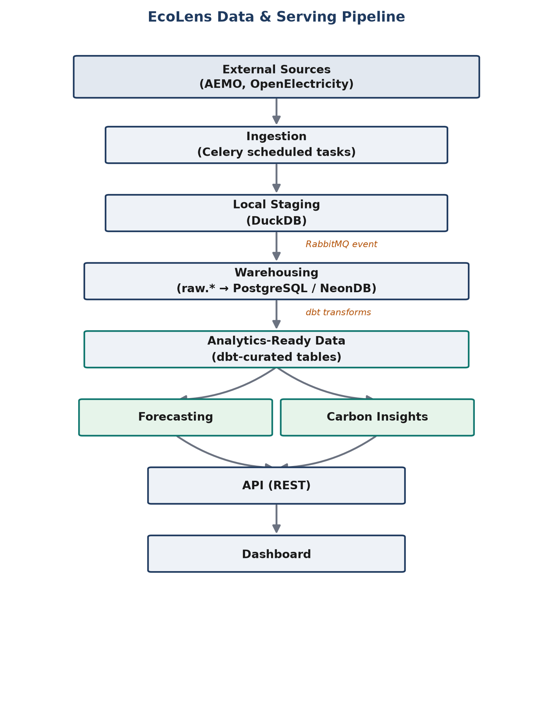
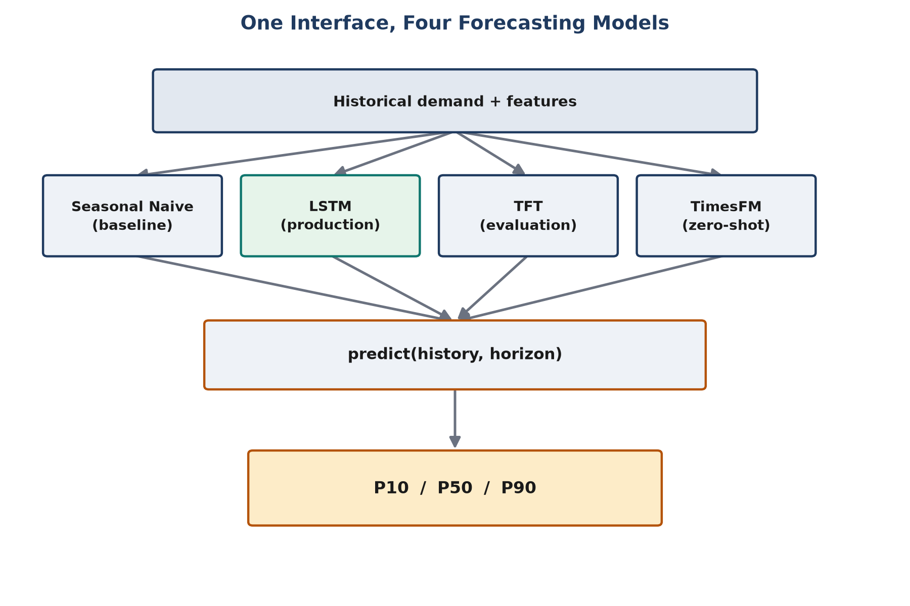
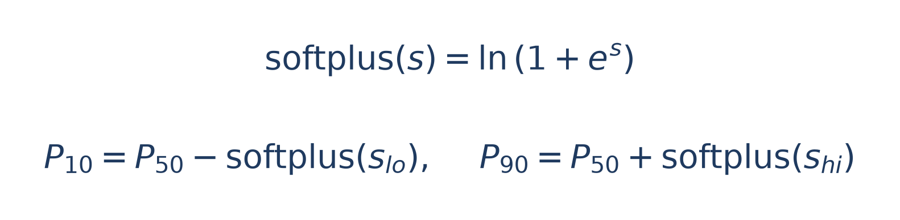
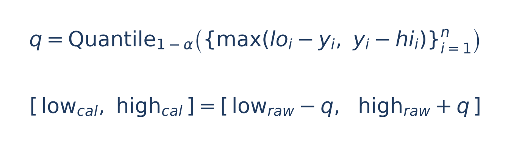
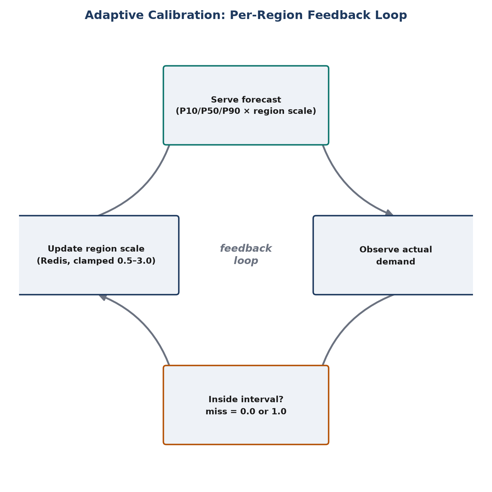

From Energy Data to Carbon-Aware Forecasts: Building EcoLens
How EcoLens turns constantly changing electricity data into forecasts, carbon insights, and a more dependable foundation for energy intelligence.
Imagine opening an energy dashboard and seeing a forecast that electricity demand will reach 9,000 megawatts tomorrow evening.
That number may look simple. But behind it are several difficult questions:
Where did the data come from?
Can the latest measurements be trusted?
What patterns does the model recognize?
How certain is the prediction?
Does the model need to be this large?
What happens if its uncertainty estimates become unreliable?
How can electricity demand be connected to environmental impact?
Electricity demand is never static. It changes throughout the day, follows weekly routines, responds to weather, varies across regions, and reacts to market conditions. Predicting it accurately is not simply a matter of drawing a line into the future.
It requires a complete system for collecting data, learning patterns, measuring uncertainty, and delivering useful results.
This is the problem EcoLens is designed to address.
EcoLens is a near-real-time energy intelligence platform focused on electricity-demand forecasting and carbon-aware analysis. It collects energy-market data, transforms it into structured time-series datasets, evaluates multiple forecasting approaches, and makes predictions available through an API and dashboard.
But the platform’s work does not end when a model produces a forecast.
EcoLens also asks whether the model can be made smaller without losing meaningful accuracy, whether its uncertainty intervals deserve to be trusted, and whether its behavior remains reliable as real-world conditions change.
Behind a single “next 24 hours of demand” chart are multiple models, data-processing stages, optimization experiments, calibration mechanisms, and operational safeguards.
This article explains how those pieces fit together.

1. Before Prediction Comes Data
A forecasting model cannot work directly with a messy stream of market observations.
Before it can predict tomorrow’s electricity demand, the platform must establish what happened today—and ensure that the historical record is trustworthy.
EcoLens integrates energy data from sources such as the Australian Energy Market Operator (AEMO) and OpenElectricity. It is designed to work with multiple electricity regions, including:
New South Wales — NSW1
Queensland — QLD1
Victoria — VIC1
South Australia — SA1
Tasmania — TAS1
Western Australia’s WEM/SWIS data, where available
Each region has its own generation mix, weather conditions, consumption habits, and market behavior. A forecasting approach that performs well in one region may not perform equally well in another.
The data pipeline therefore handles several responsibilities:
Ingesting new observations at regular intervals.
Normalizing timestamps and regional identifiers.
Validating missing, duplicated, or abnormal records.
Building historical demand sequences.
Generating features used by forecasting models.
Storing processed data for training, evaluation, and serving.
For a non-technical reader, this is similar to preparing ingredients before cooking. Even the best recipe cannot produce a good meal if the ingredients are missing, mislabeled, or inconsistent.
For a technical reader, the principle is equally important:
Every model should receive clean, consistently structured data, regardless of where that data originated.
A forecast is only as dependable as the data pipeline supporting it.

2. The Architecture Behind the Forecast
EcoLens uses a decoupled, event-driven architecture. Instead of forcing every component to work synchronously, the platform separates data collection, warehousing, forecasting, and presentation into independently managed stages.
At a high level, the journey looks like this:
External energy sources → Ingestion → Local staging → Event-driven warehousing → Analytics-ready data → Forecasting → Carbon insights → API → Dashboard
In diagram form, the same flow looks like this:

Ingestion: Collecting the raw material
Scheduled processes trigger asynchronous background tasks through Celery to collect operational energy data from external REST APIs at their respective polling intervals.
Incoming payloads are first captured and staged in DuckDB, a lightweight analytical database. This provides a fast local environment for ingestion, normalization, and preparation without requiring every incoming record to be written directly to the cloud warehouse.
Once staging is complete, RabbitMQ publishes completion events to notify the downstream warehousing service.
This separation means ingestion does not have to wait for warehouse processing to finish before continuing its work.
Warehousing: Preserving history and creating trustworthy datasets
The warehousing service copies staged data into the raw.* schema in PostgreSQL, preserving the data as received from external providers.
Maintaining this raw history creates an audit trail. It allows the platform to trace records back to their source, investigate data issues, and reprocess historical data if transformation rules change.
EcoLens uses NeonDB’s serverless PostgreSQL as its persistent analytical warehouse. dbt then transforms raw data into curated, analytics-ready tables.
These curated datasets support:
Forecasting
Carbon accounting
Historical analysis
Dashboards
Reporting
The platform also uses object storage for artifacts and historical files, while Redis supports low-latency operational needs such as caching and adaptive calibration state.
The result is a layered storage strategy:
Raw data: Preserved for auditability and reprocessing.
Curated data: Cleaned and structured for analytics and machine learning.
Local analytical storage: Used for efficient staging and processing.
Object storage: Used for persistent artifacts and files.
The goal is to balance cost, performance, reliability, and analytical flexibility.

3. Why Forecasting Demand Matters for Carbon Intelligence
Electricity-demand forecasting answers an important operational question:
How much electricity will be needed in the future?
But demand alone does not explain the environmental impact of meeting that demand.
Two periods with identical electricity consumption can have very different carbon footprints depending on how that electricity is generated.
For example, a generation mix containing more renewable energy may have a different carbon intensity from one relying more heavily on fossil fuels.
EcoLens therefore combines demand forecasts with carbon-intensity and renewable-energy data obtained from external providers.
This enables the platform to connect:
Expected electricity demand + Expected generation mix → Carbon-aware energy insights
Where renewable-energy metrics are unavailable, the platform derives the renewable proportion from the observed generation mix, helping preserve carbon insights when external data is incomplete.
The distinction is important:
Demand forecasting estimates how much electricity may be required.
Carbon analysis estimates the environmental impact associated with producing that electricity.
Together, they provide a more complete picture of future energy conditions.

4. Why EcoLens Uses Multiple Forecasting Models
There is no universally best forecasting model.
A simple statistical method can outperform a sophisticated neural network when demand is highly regular. A deep-learning model may discover nonlinear relationships that a simple baseline cannot. A pretrained foundation model may generalize well to unfamiliar datasets but still lack the domain-specific information needed for a production energy application.
Instead of assuming that one architecture must win, EcoLens evaluates four different approaches:
Seasonal Naive — A simple historical baseline.
LSTM — The current production deep-learning model.
Temporal Fusion Transformer (TFT) — A more expressive architecture under evaluation.
TimesFM — A pretrained time-series foundation model used in zero-shot experiments.
The four approaches sit side by side behind one shared interface:

Although their internal mechanisms differ, they are evaluated through a common conceptual interface:
predict(history, horizon) → (P10, P50, P90)
Here:
history is the observed demand sequence.
horizon is the number of future time steps.
P50 is the central forecast.
P10 and P90 represent lower and upper forecast estimates.
This common structure allows the rest of the application to work with different models without understanding every internal detail.
It also creates a more disciplined comparison.
Rather than asking:
“Which model sounds most advanced?”
EcoLens can ask:
Which model produces useful predictions, communicates uncertainty reliably, and operates at a reasonable cost?

5. Seasonal Naive: The Baseline That Keeps Models Honest
The Seasonal Naive model is intentionally straightforward.
It assumes that the future will resemble a corresponding period in the past. If electricity demand follows a strong weekly pattern, the forecast for Monday at 2:00 p.m. might begin with demand observed during a previous Monday at 2:00 p.m.
The seasonal period depends on the dataset’s sampling frequency and the recurring pattern being modeled. It might represent one day, one week, or another operational cycle.
Its value is not sophistication. Its value is comparison.
If an LSTM produces lower forecast error than Seasonal Naive, that suggests the neural network is learning something beyond ordinary repetition. If it performs worse, the added complexity may not be justified.
Seasonal Naive can also serve as a potential fallback when a machine-learning model fails a health check or encounters invalid inputs.
However, it cannot naturally understand sudden structural changes, unusual weather, market disruptions, long-term trends, or complex interactions between external variables.
It is not intended to be the most intelligent model.
It is intended to establish a reliable reference point.
In forecasting, simplicity is not the enemy. Unmeasured complexity is.

6. LSTM: The Current Production Forecaster
EcoLens’s current production deep-learning model is an LSTM, or Long Short-Term Memory network.
LSTMs are designed for sequential data. They process observations in order and maintain internal representations of earlier time steps, making them suitable for electricity-demand forecasting.
Demand may rise after people wake up, peak during working hours, change in the evening, or behave differently during holidays. Recent demand can also provide clues about what happens next.
The two-layer recurrent encoder
The EcoLens LSTM uses a two-layer recurrent encoder:
Historical demand sequence
          │
          ▼
   LSTM Encoder Layer 1
          │
          ▼
   LSTM Encoder Layer 2
          │
          ▼
   Temporal representation
          │
          ▼
    Attention pooling
          │
          ▼
   Forecasting heads
          │
          ▼
      P10 / P50 / P90
The first layer processes the input sequence, while the second learns a higher-level representation of temporal patterns.
After encoding, the model applies attention pooling. This allows it to assign different importance to different historical observations rather than relying only on the final recurrent state.
For example, a recent demand spike, a similar time from the previous day, or a recurring weekly pattern may matter differently depending on the forecast context.
Predicting uncertainty, not just one number
EcoLens does not only predict one number. Its LSTM produces a central forecast alongside lower and upper uncertainty estimates.
Conceptually:
P10 = point forecast − positive lower spread

P50 = point forecast

P90 = point forecast + positive upper spread
Positive spread transformations, such as softplus, help ensure that the predicted spreads remain non-negative:

Because softplus(s) is always positive regardless of the raw value s, the model can freely output any real-valued spread and still be guaranteed a valid, non-negative P10–P90 interval around P50.
The model is trained using quantile-oriented objectives, including pinball loss. For a target quantile τ (e.g., 0.1, 0.5, 0.9), actual value y, and predicted value ŷ, pinball loss is:
L_τ(y, ŷ) = max( τ · (y − ŷ), (τ − 1) · (y − ŷ) )
This penalizes under-prediction and over-prediction asymmetrically depending on τ, which is what pushes the P10 and P90 heads apart from the P50 head instead of collapsing to the same value. Conformal calibration is then used to improve the reliability of the resulting prediction intervals.
The LSTM is currently selected for production because it offers a practical balance between forecasting capability, computational cost, implementation maturity, serving simplicity, and operational reliability.
That does not mean it is permanently the best model.
It means it is the model that has currently earned its place in the production pipeline.

7. TFT and TimesFM: Testing Whether More Complexity Creates More Value
The Temporal Fusion Transformer (TFT) is a more expressive forecasting architecture that combines recurrent components, attention, variable selection, gated residual connections, and static enrichment.
EcoLens includes a hand-rolled TFT implementation as an alternative to the LSTM. Its static enrichment pathway exists conceptually, although the current static context is represented by a zero vector rather than a rich learned regional embedding.
The TFT is trained and evaluated independently, but it is not currently the sole production-serving model.
A model can train successfully and still require additional validation before deployment. Accuracy, latency, resource usage, failure behavior, and reproducibility all matter.
The fourth approach is TimesFM, a pretrained time-series foundation model developed by Google.
TimesFM is used primarily in a zero-shot or frozen-checkpoint configuration. It offers an opportunity to test whether broad pretrained temporal knowledge can transfer to electricity demand without extensive task-specific training.
However, its current setup primarily uses raw demand history rather than the full set of EcoLens’s domain-specific features. It may not directly incorporate weather forecasts, regional metadata, market variables, or operational constraints.
TimesFM is therefore valuable as an experimental benchmark—not an automatic replacement for a specialized production model.
The underlying principle is the same for both architectures:
Complexity is valuable only when evaluation demonstrates that it earns its cost.

8. Making the Model Smaller Without Making It Wrong
Once a forecasting model works, another question becomes important:
Does it need to be this large?
EcoLens’s production DemandLSTM has 128 hidden units per layer. That configuration was selected empirically, but model size should not become a permanent assumption simply because it worked once.
A smaller model could be cheaper to store, load, and run. But reducing capacity can also damage accuracy.
EcoLens therefore approaches pruning as an experiment that must be measured—not as an optimization that is automatically considered successful.
Why structured pruning matters
EcoLens’s pruning work is scoped to the LSTM.
The implementation performs structured pruning, meaning it removes complete logical hidden units rather than merely setting individual weights to zero.
This distinction matters.
Zero-masking leaves the model physically the same size. The tensor still occupies the same storage, and dense hardware may not run faster simply because some values are zero.
EcoLens instead performs physical compaction: it rebuilds a smaller model and copies only the surviving weights.
How units are selected
The pruning process ranks hidden units using L2-norm importance scores. It considers both:
How strongly a unit is computed.
How strongly that unit feeds into other units.
This matters because a unit can be important as an input to other units even if its own outgoing computation appears relatively small.
The compaction process updates the affected recurrent weights, biases, attention layer, and forecasting heads. It also returns the original indices of the surviving units, making the decision auditable.
A basic correctness invariant is tested:
When the keep fraction is 1.0 and nothing is pruned, the compacted model must reproduce the original weights exactly.
The pruning gate
Compaction alone is not enough. EcoLens runs a complete pipeline:
Load a registered LSTM version.
Compact it structurally.
Measure parameter count, artifact size, and CPU inference latency.
Fine-tune the compacted model to recover lost capacity.
Re-evaluate it through the same walk-forward harness.
Check whether the result passes both efficiency and accuracy requirements.
The efficiency gate requires the artifact to be at least 5% smaller and not more than 10% slower.
A separate accuracy check requires recovered walk-forward MAPE regression to remain within a default 1% tolerance of the unpruned version. MAPE (Mean Absolute Percentage Error) over n walk-forward samples is defined as:
MAPE = (100 / n) · Σ | (yᵢ − ŷᵢ) / yᵢ |
The "regression" figures quoted below are the relative change in this MAPE between the compacted model and the original unpruned model.
Even when the gate passes, the recovered model is registered to MLflow with a prune_gate_passed tag but is not automatically promoted to Production.
If pruning fails, the result is recorded honestly:
“Pruning was not worth it at this model size.”
That is a useful engineering result, not something to hide.
A lesson from recovery
The pruning experiment also exposed a practical issue: recovery fine-tuning needs enough time to relearn after a structural cut.
At a 50% keep fraction, three recovery epochs produced a severe relative walk-forward MAPE regression of +131.2%. Fifteen epochs recovered performance to better than the unpruned version, reaching approximately −21.1% relative regression. The current default was subsequently increased to 20 recovery epochs.
The lesson is broader than pruning:
An optimization is not complete when the code runs. It is complete when the resulting system has been measured.

9. Conformal Calibration: Making Uncertainty More Trustworthy
A forecast interval labeled P10–P90 may sound like an 80% confidence range.
But raw quantile-regression outputs do not automatically guarantee that the true value will fall inside that interval 80% of the time.
A model can have low pinball loss and still produce intervals that are too narrow.
EcoLens addresses this with Conformalized Quantile Regression, or CQR.
How CQR works
CQR uses a held-out calibration split that the model did not train on.
For each calibration sample, it measures how far the actual value falls outside the raw prediction interval:
scores = np.maximum(lo_cal - y_cal, y_cal - hi_cal)
It then calculates a calibrated quantile of these nonconformity scores and uses that value to adjust future intervals:

In simple terms, if the model’s original interval was too narrow on held-out data, the calibration layer widens it by an amount supported by that evidence.
EcoLens persists the calibration result as an MLflow artifact, allowing serving to load and apply it automatically.
Why the order matters
EcoLens applies regional bias correction before conformal calibration.
This is deliberate.
Conformal calibration adjusts interval width around the model’s central forecast; it does not fix a forecast that is systematically shifted too high or too low.
Bias correction addresses the center first. Conformal calibration then measures how much uncertainty remains around that corrected center.
Coverage is computed and logged for both raw and calibrated intervals so the result can be inspected rather than assumed.
The important limitation
Conformal coverage guarantees rely on assumptions such as exchangeability.
Chronological time-series data does not strictly satisfy this assumption when demand patterns shift over time. That means CQR is not a magical guarantee under every deployment condition.
If the data distribution changes substantially, historical calibration may no longer describe current reality.
It also cannot fix a systematically mis-centered forecast. That requires better modeling or bias correction.

10. Adaptive Calibration: Responding to Drift After Deployment
Static calibration is calculated at training time.
But real-world demand volatility can change after a model is deployed.
EcoLens therefore includes an adaptive calibration layer inspired by Adaptive Conformal Inference.
For each model-and-region pair, the system maintains a scalar multiplier in Redis. When a served forecast is later reconciled against the actual observed demand, the multiplier is updated based on whether the outcome fell inside the predicted interval.
Conceptually:
miss = 0.0 if covered else 1.0

updated = current + step_size * (miss - target_alpha)

updated = min(max(updated, MIN_SCALE), MAX_SCALE)
A miss gradually pushes the scale upward, widening future intervals. A hit nudges it downward.
As a feedback loop, this looks like:

The scale is bounded between 0.5 and 3.0, preventing it from collapsing toward zero or expanding without limit. The update step is deliberately small, allowing the system to respond gradually rather than overreact to a short streak of unusual outcomes.
The adaptive layer is not intended to replace the model. It addresses a different problem:
Adaptive calibration: The model is still appropriate, but its uncertainty needs adjustment.
Forecast-quality circuit breaker: The model’s behavior has deteriorated enough that the system should fall back to a simpler method.
This separation is important.
Not every calibration issue requires replacing the entire forecasting model.
What the regional results revealed
Walk-forward evaluation on real warehouse data showed uneven coverage before calibration and tuning:
Region
Coverage
Bias (P50 − actual, MW)
NSW1
0.833
−98.9
QLD1
0.771
−343.1
VIC1
0.776
+57.3
SA1
0.891
−27.5
TAS1
0.984
+88.4
WEM
0.865
+20.9

The target coverage was 80%.
These results show why a single global correction is insufficient. Bias varies in both direction and magnitude across regions.
Per-region bias correction helped substantially in some cases. NSW1 and TAS1, for example, moved to within approximately 6 MW of zero bias in the follow-up experiment.
But other regions became worse, suggesting that a small calibration split—roughly 25–27 rows per region—was not always stable enough to estimate persistent regional bias.
That result is not a failure of the experiment.
It is evidence that calibration must be evaluated carefully, especially when data is limited and behavior changes over time.

11. From Model Experiments to Production Reliability
All these mechanisms depend on consistent evaluation.
EcoLens uses a shared walk-forward evaluation harness to compare models under conditions that resemble real forecasting.
The process measures:
Central forecast accuracy
Quantile loss
Interval coverage
Interval width
Regional stability
Performance across different horizons
This same discipline extends to pruning and calibration.
A smaller model is not accepted merely because its parameter count decreases. It must also preserve accuracy and meet latency requirements.
A calibrated interval is not trusted merely because a correction formula was applied. Its empirical coverage must be measured.
And a model is not promoted to production merely because it exists in the codebase.
The operational system must also handle:
Missing observations
Delayed ingestion
Invalid values
Model-loading failures
Distribution changes
Resource constraints
API timeouts
Regional outages
EcoLens includes components for scheduled ingestion, transformation, model training, registration, serving, caching, monitoring, logging, metrics, tracing, and alerting.
A future forecast-quality circuit breaker can reject outputs containing NaN values, impossible negative demand, implausible jumps, severe drift, excessively wide intervals, or failed health checks—and fall back to the Seasonal Naive baseline when necessary.
The goal is not to pretend that models never fail.
The goal is to make failure detectable, bounded, and recoverable.

12. Making the Results Understandable
A technically sophisticated platform is only useful if people can understand and act on its outputs.
EcoLens presents complex energy, forecasting, and sustainability data through a web application built with Next.js.
Rather than requiring users to interpret raw datasets or API responses, the application provides an interface for:
Exploring historical trends
Monitoring real-time grid conditions
Analyzing demand forecasts
Understanding carbon emissions
Comparing energy-generation patterns
The frontend communicates with the backend through REST APIs, keeping the user interface decoupled from the underlying ingestion, warehousing, and machine-learning services.
Interactive dashboards, charts, maps, and forecasting visualizations help users identify trends, compare historical and predicted values, monitor system behavior, and interpret carbon-related metrics.
For a non-technical user, the result is a clearer view of what may happen on the grid and what that could mean environmentally.
For a technical user, it is the visible layer of a much larger data and machine-learning system.

Conclusion: Forecasting Should Be Earned
EcoLens is not built around the assumption that the newest or most complicated model must be the best one.
Its architecture combines a simple baseline, a production LSTM, a more advanced Temporal Fusion Transformer, and a pretrained foundation model. Each offers a different trade-off between simplicity, expressiveness, generalization, uncertainty estimation, and operational cost.
But the platform goes further than model selection.
It asks whether the production LSTM can be physically reduced in size without sacrificing meaningful accuracy. It uses structured pruning, recovery fine-tuning, and explicit efficiency gates to answer that question.
It asks whether uncertainty intervals deserve to be trusted. It uses conformalized quantile regression to calibrate them against held-out evidence, then uses adaptive calibration to respond to drift after deployment.
It preserves raw data for auditability, separates ingestion from warehousing, and uses a shared evaluation framework to make model comparisons more meaningful.
And it records when these mechanisms do not work as hoped.
That is the common thread:
Compute a real before-and-after. Compare it against a real threshold. Register the result. Keep production promotion deliberate.
Ultimately, a forecasting model should not enter production because it is fashionable, complex, or impressive on paper.
It should enter production because it has demonstrated that it can produce useful predictions, communicate uncertainty honestly, operate reliably, and improve the decisions the platform is designed to support.
That is the standard EcoLens is working toward:
Not just predicting energy demand, but building a dependable foundation for carbon-aware energy intelligence.

